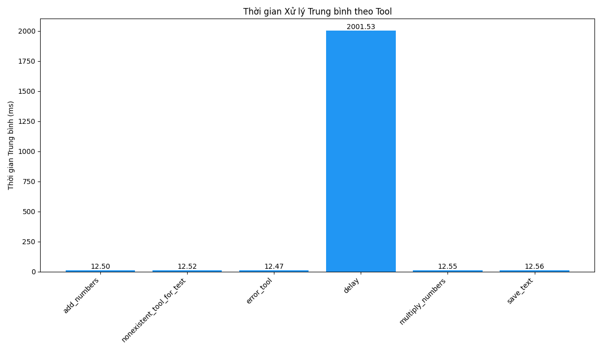

# Báo cáo Phân tích Log Batch

## 1. Thống kê Tổng quát

| Chỉ số          | Giá trị   |
|-----------------|-----------|
| Tổng số requests | 500       |
| Thành công      | 200       |
| Thất bại        | 300       |
| Tỷ lệ thành công | 40.0%     |
| Tỷ lệ thất bại  | 60.0%     |

## 2. Thời gian Xử lý Trung bình

| Trạng thái | Thời gian trung bình (ms) |
|------------|--------------------------|
| Success    | 12.53                    |
| Failed     | 509.76                   |

## 3. Phân tích theo Tool

| Tool                        | Số lượng | Thời gian TB (ms) | Ghi chú          |
|-----------------------------|----------|-------------------|------------------|
| add_numbers                 | 145      | 12.50             |                  |
| nonexistent_tool_for_test | 75       | 12.52             | ⚠️ Lỗi tool không tồn tại |
| error_tool                  | 75       | 12.47             | ⚠️ Lỗi runtime dự kiến |
| delay                       | 75       | **2001.53**       | 🔴 Rất chậm (Timeout) |
| multiply_numbers            | 70       | 12.55             |                  |
| save_text                   | 60       | 12.56             |                  |

## 4. Khuyến nghị

*   **Tool `delay`:** Thời gian trung bình rất cao (> 2000ms), chủ yếu do timeout. Cần xem xét lại logic timeout hoặc mục đích sử dụng tool này trong batch. Nếu timeout là mong muốn để test, cần ghi chú rõ. Nếu không, đây là ứng viên hàng đầu cần tối ưu hoặc loại bỏ khỏi các batch request thông thường.
*   **Tool `error_tool` và `nonexistent_tool_for_test`:** Các tool này gây ra lỗi theo thiết kế (runtime error và tool not found). Chúng chỉ nên được sử dụng trong môi trường test, không nên xuất hiện trong batch production.
*   **Các tool khác (`add_numbers`, `multiply_numbers`, `save_text`):** Có thời gian xử lý trung bình thấp và ổn định, hoạt động tốt.
